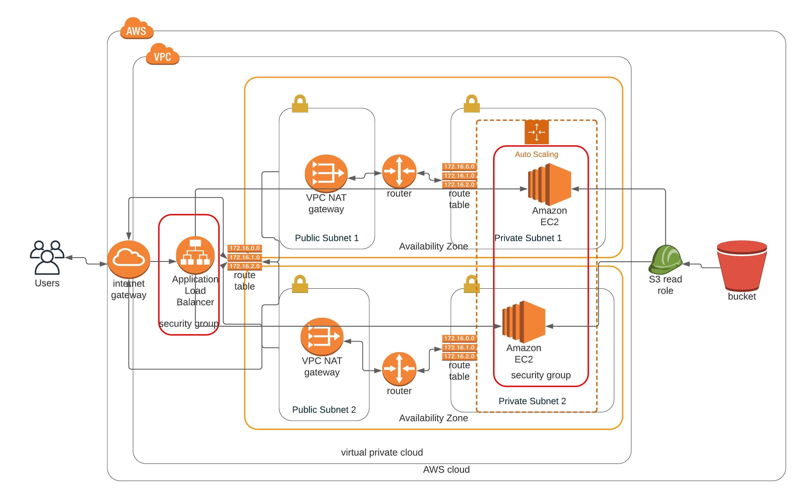

# Deploy_a_high_availability_web_app_using_cloudformation

## Architecture Diagram



The **network.yaml** file is for creating the network VPC, Subnets etc. using the **network-parameters.json** as input parameters.
The webservers which include the Load Balancer, AutoScaling Groups and Security Groups are created using **servers.yaml** using the **server-parameters.json** file as the input.

## Instructions

1. First create the network by running
```
aws cloudformation create-stack --stack-name OmarMerghanyProj02 --template-body file://network.yml  --parameters file://network-parameters.json --capabilities "CAPABILITY_IAM" "CAPABILITY_NAMED_IAM"  --region=us-west-2
```
2. Second create the servers, ASG and loadbalancer
```
aws cloudformation create-stack --stack-name WebServerStack --template-body file://servers.yml  --parameters file://server-parameters.json --capabilities "CAPABILITY_IAM" "CAPABILITY_NAMED_IAM" --region=us-west-2
```
## Output Website
Go to the exported DNS endpoint, the output should look like
